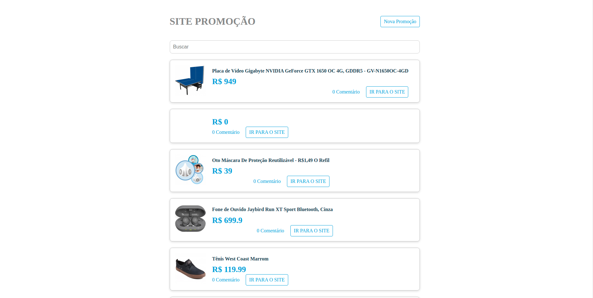

[Ver o Leia-Me em Português](README-pt-br.md)

This project was bootstrapped with [Create React App](https://github.com/facebook/create-react-app).

# Promotions Site
This was a website developed with study material and also with the objective of helping people find promotions of different objects.

<div align="center">
    
</div>

## Available Scripts
In the project directory, you can run:

## : Information_source: About
The project we have (API using Json Server) and the Front End using ReactJS.

## To run the project on your machine
``` bash
git clone https://github.com/SenaBel/react-projeto-site.git
cd react-projeto-site
```
Enter in folder **api** for install the dependencies 'npm install'
Enter in folder **site** for install the dependencies 'npm install'

### `yarn start`

Runs the app in the development mode.<br />
Open [http://localhost:3000](http://localhost:3000) to view it in the browser.

The page will reload if you make edits.<br />
You will also see any lint errors in the console.

### Abel Sena

- GitHub: [@SenaBel](https://github.com/SenaBel)
- LinkedIn: [@Abel Sena](www.linkedin.com/in/abel-sena)
